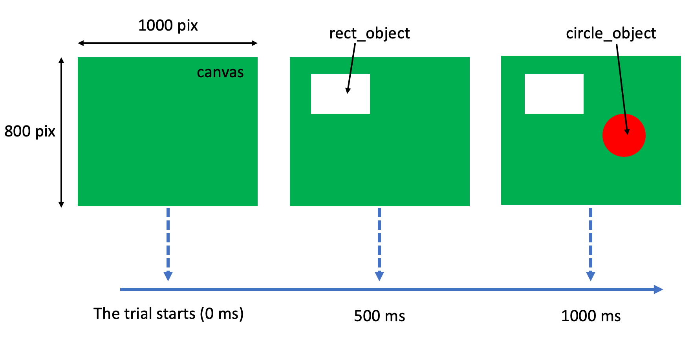

jspsych-psychophysics is a plugin for conducting Web-based psychophysical experiments using [jsPsych](http://www.jspsych.org/) (de Leeuw, 2015).
This plugin can be used free of charge under the MIT license.

## What you can do with the jspsych-psychophysics plugin
- You can present a set of stimuli asynchronously. In other words, the plugin can set the stimulus onset asynchrony (SOA).
- You can present visual stimuli (e.g., image, line, rectangle, circle, and text) at intended coordinates. You can also present moving objects and play sound files.
- This plugin presents visual stimuli synchronized with the refresh of the display using the **requestAnimationFrame** method. As a result, the display duration would be more accurate.
- According to my observation, the SOA between visual stimuli with the plugin was more accurate than that without the plugin. I am preparing a paper.

## How to use the jspsych-psychophysics plugin
This is the brief explanation how to use the plugin. Please refer to [the parameters of the plugin](pluginParams.md) and [the properties of the object](objectProperties.md) in detail.

This figure illustrates a trial flow to be made by this tutorial.


### 1. Download the plugin file
[Please download the latest files from GitHub.](https://github.com/kurokida/jspsych-psychophysics/releases)
The package includes the comaptible [jsPsych](http://www.jspsych.org/) (de Leeuw, 2015), and released under [the MIT license](https://opensource.org/licenses/MIT).


### 2. Include the plugin file using the `<script>` tag

```javascript
<script src="jspsych-psychophysics.js"></script>
```
This procedure is the same when other plugins are used with the jsPsych. Be sure to the location of the plugin file.

### 3. Specify all the stimuli used in the program as a JavaScript object

```javascript
var rect_object = {
    obj_type: 'rect', // means a rectangle
    startX: 200, // location in the canvas
    startY: 150,
    width: 300, // of the rectangle
    height: 200,
    line_color: '#ffffff',
    fill_color: '#ffffff',
    show_start_time: 500 // from the trial start (ms)
}

var circle_object = {
    obj_type: 'circle',
    startX: 500, // location in the canvas
    startY: 300,
    radius: 100,
    line_color: 'red', // You can use the HTML color name instead of the HEX color.
    fill_color: 'red',
    show_start_time: 1000 // from the trial start (ms)
}
```

The origin of the coordinate is the top left of the canvas, and the unit is the pixel. The color can be specified using the HTML color names, hexadecimal (HEX) colors, and RGB values that are often used in a general HTML file. 

The **show_start_time** is the most notable property in this object, which enables to present the stimulus at the intended time. In this example, a white rectangle is presented 500 ms after beginning this trial, after another 500 ms, a red circle is presented until the response.

### 4. Specify a trial object in the jsPsych's timeline

```javascript
var trial = {
    type: 'psychophysics',
    stimuli: [rect_object, circle_object],
    choices: ['y', 'n'], // The participant can respond to the stimuli using the 'y' or 'n' key.
    canvas_width: 1000,
    canvas_height: 800,
    background_color: '#008000', // The HEX color means green.
}

jsPsych.init({
    timeline: [trial],
    on_finish: function(){jsPsych.data.displayData();}
});
```

The **stimuli** property must include all the objects to be presented in the trial.

This trial object must be included as the **timeline** property of the jsPsych.init which is a core function of the jsPsych.

Note that if you use image and audio files in a trial, please preload them using the preload_images and preload_audio methods in the jsPsych.init. See, demos/randomizedImages.html and demos/towSoundsWithSOA.html.

You can also make the participants respond using a mouse instead of a keyboard using the **response_type** property. See, demos/localize-circle.html.

## These are links to the programs used in my research to evaluate SOAs
- [Two white squares are presented asynchronously without the jspsych-psychophysics plugin](http://www.psycho.hes.kyushu-u.ac.jp/jspsych-6.0.5-multi-objects/examples/native_two_rectangles.html)
- [Two white squares are presented asynchronously with the jspsych-psychophysics plugin](http://www.psycho.hes.kyushu-u.ac.jp/jspsych-6.0.5-multi-objects/examples/pp_two_rectangles.html)
- [A white square and a sin-wave sound are presented asynchronously without the jspsych-psychophysics plugin](http://www.psycho.hes.kyushu-u.ac.jp/jspsych-6.0.5-multi-objects/examples/native_rect_sound.html)
- [A white square and a sin-wave sound are presented asynchronously with the jspsych-psychophysics plugin](http://www.psycho.hes.kyushu-u.ac.jp/jspsych-6.0.5-multi-objects/examples/pp_rect_sound.html)

Copyright (c) 2019 Daiichiro Kuroki  
Released under [the MIT license](https://opensource.org/licenses/MIT)
